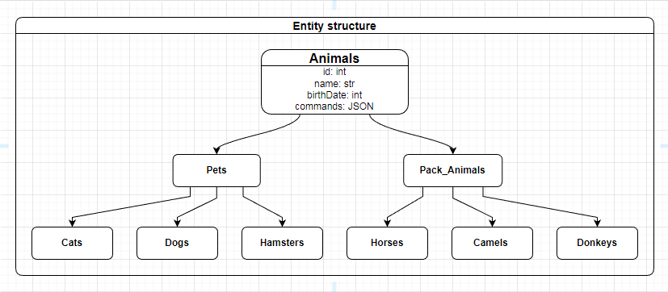

# Итоговая контрольная работа по специализации "Программист"

## Информация о проекте
- Необходимо организовать систему учета для питомника в котором живут домашние и вьючные животные.

## Как сдавать проект
- Для сдачи проекта необходимо создать отдельный общедоступный репозиторий.
- Разработку вести в этом репозитории, использовать пул реквесты на изменения.
- Программа должна запускаться и работать, ошибок при выполнении программы быть не должно.
- Программа, может использоваться в различных системах, поэтому необходимо разработать класс в виде конструктора.

 

## Задание
### Блок по работе с терминалом в OS Linux
- Операции с файлами:
    1. Используя команду cat создать файл "Домашние животные", с данными: собаки, кошки, хомяки.
    2. Создать файл "Вьючные животные", с данными: лошади, верблюды, ослы.
    3. Объединить созданные файлы.
    4. Вывести содержимое созданного файла.
    5. Переименовать файл в "Друзья человека".
    6. Создать директорию, переместить в нее файл.
- Репозотории и работа с пакетами
    1. Подключить дополнительный репозиторий MySQL.
    2. Установить любой пакет из подключенного репозитория.
    3. Установить и удалить deb-пакет с помощью dpkg.
- Выложить историю команд из терминала OS Linux.

 

### Блок по работе с Диаграммами
- Нарисовать диаграмму:
    1. Родительский класс.
    2. Подклассы домашние животные и вьючные животные.
    3. Подклассы для домашних животных: собаки, кошки, хомяки.
    4. Подклассы для вьючных животных: лошади, верблюды, ослы.

 

### Блок по работе с SQL в СУБД MySQL
- Создать базу данных "Друзья человека" // "human_friends"
    1. Создать таблицы "pets", "dogs", "cats", "hamsters", "pack_animals", "horses", "camels", "donkeys" с иерархией из диаграммы.
    2. Низкоуровневые таблицы должны иметь следующие поля:
        - имена животных.
        - команды которые животные выполняют.
        - даты рождения животных.
    3. Наполните низкоуровневые таблицы данными.
    4. Удалите таблицу верблюды.
    5. Объедините таблицы "лошади" и "ослы".
    6. Создайте таблицу "молодые животные". // "young_animals"
        - В отдельном столбце с точностью до месяца должен храниться возраст животных.
    7. Поместите в нее всех животных старше 1 года и младше 3 лет.
    8. Объединить все таблицы в одну, при этом сохраняя поля, указывающие на прошлую принадлежность к старым таблицам.

 

### Блок "Программирование"
- Создайте класс с Инкапсуляцией методов и наследованием по диаграмме.
- Напишите программу, имитирующую работу реестра домашних животных, со следующим функционалом:
    1. Завести новое животное.
    2. Определять животное в правильный класс.
    3. Увидеть список команд, которое выполняет животное.
    4. Обучить животное новым командам.
    5. Реализовать навигацию по меню.
- Создайте класс-счетчик, со следующим функционалом:
    1. Метод add(), увеличивающий значение внутренней int переменной на 1 при нажатии "Завести новое животное".
    2. Объект типа счетчик должен уметь работать в блоке try-with-resources.
    3. Должно срабатывать исключение, если работа с объектом типа счетчик была не в ресурсном try и/или ресурс остался открыт.
    4. Значение считать в ресурсе try, если при заведения животного заполнены все поля.

  

## Команды для GIT
### Создание локального репозитория
> git init
- В Windows по умолчанию создает ветку master

 

### Переименование главной ветки в main для GitHub
> git branch -M main

 

### Создание локального репозитория c главной веткой main
> git init --initial-branch=main
- Указывает имя создаваемой главной ветки для репозитория

 

### Добавление всех файлов в отслеживаемые
> git add .

 

### Создание коммита
> git commit -m "Initial commit"

 

### Подключение к удаленному репозиторию
> git remote add origin https://github.com/BloodRaven707/Final_Certification_Developer.git

 

### Загрузка в удаленный репозиторий
> git push -u origin main

  

## Команды Linux
### Открытие файла с возможностью ввода строк
> cat > "Домашние животние"
- Создает файл если его не существует

### Ctrl + C
- Сохранить и выйти

 

### Объединить файлы в один
> cat "Домашние животние" "Вьючные животние" > "Human friends"

 

### Вывод в терминал
> cat "Human friends"

 

### Перемещение (переименование)
> mv "Human friends" "Друзья человека"

 

### Создание дирректории
> mkdir animals

 

### Перемещение
mv "Друзья человека" ./animals/

 

### Удаление папки со всеми вложенныеми объектами
> raven@raven-vm:~$ rm -rf animals/

 

### Удаление файла
> raven@raven-vm:~$ rm "Вьючные животние"

 

### Скачиваем пакет c удаленного хранилища
> raven@raven-vm:~$ sudo wget https://dev.mysql.com/get/mysql-apt-config_0.8.25-1_all.deb

 

### Устанавливаем пакет с конфурациями с помощью dpkg
> sudo dpkg -i mysql-apt-config_0.8.25-1_all.deb

 

### Обновляем зависиости
> sudo apt update

 

### Устанавливаем пакет
> sudo apt install mysql-client -y

 

### Удаляем пакет
> sudo apt remove mysql-client -y

 

### Установка одной командой
> raven@raven-vm:~$ sudo dpkg -i mysql-apt-config_0.8.25-1_all.deb && sudo apt update && sudo apt install mysql-client

 

### Удаляем пакет через dpkg
> sudo dpkg -r mysql-client

  

## Диаграмма Task_2_Chart.xml

  

## Команды SQL
### ...
